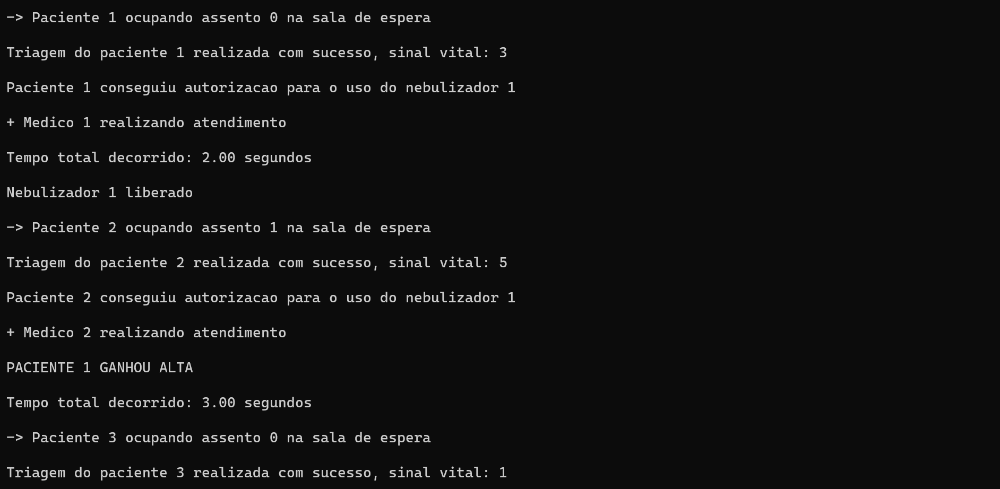
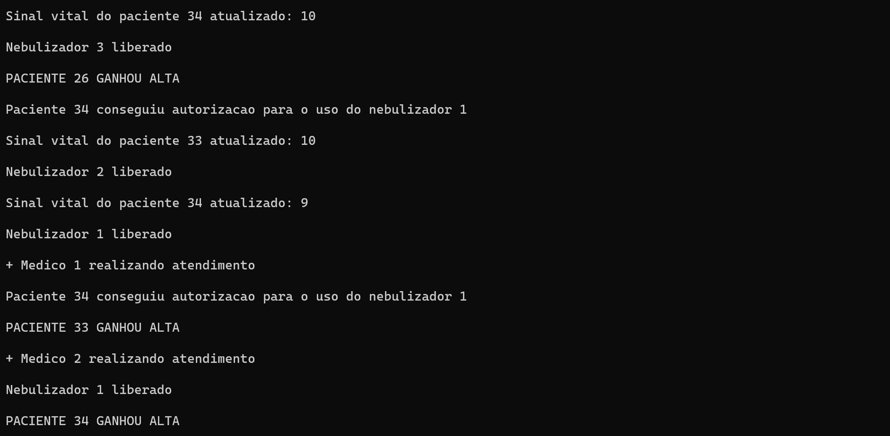
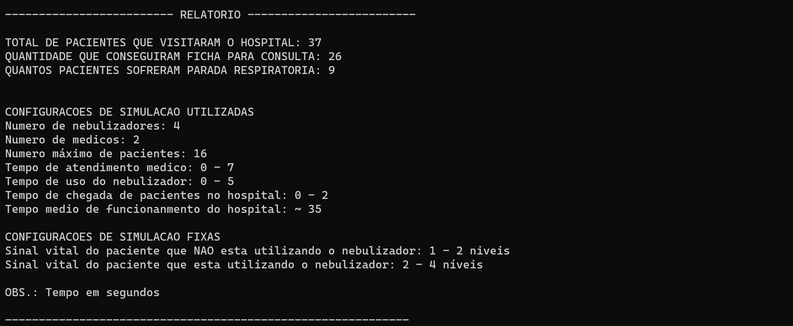

# :hospital: :sos: Simulador de Pronto-Socorro Respiratório

Este projeto de Sistemas Operacionais foi desenvolvido em colaboração com [@Caroline-Camargo](https://github.com/Caroline-Camargo) e [@BiancaBDullius](https://github.com/BiancaBDullius) e simula uma ala de pronto-socorro dedicada ao tratamento de pacientes com problemas respiratórios. Nele, cada paciente e médico são representados como threads.


## Funcionalidades Principais

- :vertical_traffic_light: :elevator: **Recursos Limitados**: A sala de atendimento possui um número limitado de nebulizadores, e os pacientes competem pelo seu uso.

- :receipt: :ambulance: **Politica de Escalonamento dos Nebulizadores**: Um chefe de enfermeiros supervisiona o acesso aos nebulizadores, garantindo que os pacientes sejam atendidos de maneira adequada.

- :chart_with_upwards_trend: :stethoscope: **Sinais Vitais Dinâmicos**: Os pacientes têm sinais vitais que variam de 0 a 10, e o tratamento com nebulizadores afeta esses sinais vitais.

- :woman_health_worker: :game_die: **Atendimento Aleatório**: O tempo de atendimento dos médicos e de uso dos nebulizadores é aleatório, tornando a simulação mais realista.

## :gear: Configurações Personalizáveis

Este simulador permite a personalização de várias configurações para ajustar a simulação de acordo com as necessidades:

- Número de nebulizadores
- Número de médicos
- Número máximo de pacientes
- Tempo de atendimento médico
- Tempo de uso do nebulizador
- Taxa de atualização do sinal vital
- Variação do tempo de chegada de pacientes no pronto-socorro
- Variação do tempo médio de funcionamento do pronto-socorro

Dessa forma, é possível explorar diferentes cenários e avaliar o funcionamento do pronto-socorro em várias situações. Vale ressaltar, que este trabalho foi desenvolvido exclusivamente para fins educacionais, permitindo a compreensão de conceitos relacionados a sistemas operacionais e escalonamento de recursos.

## :play_or_pause_button: Exemplo de Execução do Simulador:


...




## :question: Como Usar

Basta compilar e executar o programa para iniciar a simulação do pronto-socorro respiratório. Caso deseja alterar os parâmetros da simulação eles estão localizados no início do arquivo `main.c`

```bash
gcc main.c filaAtendimentoMedico.c -o main -lpthread
.\main
